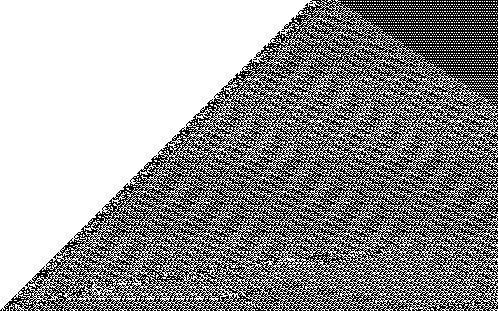

# Cellular Automata

This is a companion project that I'm working on as I read through Stephen Wolfram's "A New Kind of Science".

It contains Rust implementations of various cellular automata described in the book.

By default, the images are rotated left and displayed horizontally.

As an example, here is elementary cellular automata generated by rule 110:

